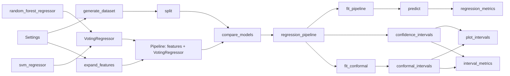

# AGENTS.md

Guidance for AI agents working on **jupyter-book-template** — Jupyter Book 2 template for MyST notebooks and GitHub Pages deployment, powered by [MyST](https://mystmd.org/). All book configuration lives in a single file: `book/myst.yml`.

## Repository layout

```
src/
  core/                 # Pandera schemas, Settings, Protocols, feature engineering
  simulation/           # Synthetic data generation
  analysis/             # Case bootstrap confidence intervals
  prediction/           # MAPIE split conformal prediction intervals
  evaluation/           # Regression metrics and interval coverage reports
  visualization/        # Altair charts and shared theme constants
tests/                  # Pytest suite (mirrors src/ 1:1, 100% coverage)
book/
  myst.yml              # Project + site configuration (TOC, theme, plugins)
  chapters/             # Book content (.md, .ipynb)
  assets/               # Site branding (favicon, logos)
  plugins/              # Custom MyST plugins
  bibliography.bib      # Citations
pyproject.toml          # Project metadata (jupyter-book-template), deps, Poe tasks
.agent/skills/          # Agent skills (e.g. sync-from-template)
.github/workflows/      # GitHub Pages deploy (main branch)
.binder/Dockerfile      # Binder environment (main branch)
```

Build output goes to `book/_build/` (gitignored). Run book commands from the repo root via Poe; tasks set `cwd = "book"`.

## Project source code

Library code lives under `src/` as installable top-level packages (`core`, `simulation`,
`analysis`, `prediction`, `evaluation`, `visualization`). They are built with
`uv_build` and installed editable on `uv sync` — chapters import them directly, never via
`sys.path`.

- Public DataFrame types are defined in `core.schemas` using Pandera `DataFrameModel`.
- Do not use bare `pd.DataFrame` in function signatures; use `pandera.typing.DataFrame[Schema]`.
- Tests mirror `src/` 1:1 under `tests/`; run with `uv run pytest`.
- Lint, format, and typecheck settings live in `pyproject.toml`; pre-commit **local** hooks run `uv run ruff` / `pylint` / `mypy` so `uv.lock` is the single source of tool versions.
- CI runs `poe check`, then `pytest`, then `poe build-book` (`uv run poe ci`).

### SOLID extension points

Forks should extend behaviour through these seams rather than editing call sites:

| Seam | Location | Purpose |
|------|----------|---------|
| `RegressorMixin` | `sklearn.base` | Swap sklearn estimators by adding them to the `VotingRegressor.estimators` list; `compare_models` reconstructs one `regression_pipeline(...)` per base internally |
| `regression_pipeline` | `prediction.regression` | Wraps a shared `features` transformer (built once via `expand_features(settings)`) + regressor as a `sklearn.pipeline.Pipeline`; used internally by `compare_models` and exposed for callers that want a single-model pipeline |
| `VotingRegressor` | `sklearn.ensemble` | Holds the comparison roster as `(name, base)` pairs inside `Pipeline([("features", …), ("ensemble", VotingRegressor(...))])`; no `final_estimator` required (averages bases). Introspected via `regressors.named_steps[ENSEMBLE_STEP].estimators` |
| `expand_features` | `core.features` | Builds the polynomial + Fourier feature stage shared across every regressor |
| `prepare_split` | `core.features` | Single helper for split selection (returns raw `x`, `y`; Pipeline owns transforms) |
| `visualization.theme` | `CHART_*`, `INTERVAL_COLOR_*` | Shared chart dimensions and palettes |

### Pipeline data flow



## Initialize the template

Use this checklist when turning the template into a new book project.

### GitHub setup

1. Fork the repository (GitHub only allows using templates you own).
2. Use **`main`** as the default branch (content, CI, and site deployment).
3. Enable **Template repository** under Settings → General.
4. Enable **GitHub Actions** if disabled.
5. Enable **GitHub Pages** with source **GitHub Actions** under Settings → Pages.
6. Clone the fork locally.

When creating a new repo from the template, select it from the template dropdown.

### Connect to upstream (before customizing)

Repos created via **Use this template** start with a single commit and **no shared Git history** with this repository ([GitHub discussion #50012](https://github.com/orgs/community/discussions/50012)). Merge from upstream **immediately after cloning**, before replacing placeholders or editing book content. At that stage the tree still matches the template snapshot, so the merge is usually conflict-free; waiting until after customization forces large `add/add` conflicts across `pyproject.toml`, `README.md`, workflows, and other infra files.

From the **child project** root (not this template repo):

```bash
git remote add template https://github.com/ELC/jupyter-book-template.git
git fetch template main
git merge template/main --allow-unrelated-histories --no-edit
git push origin main
```

Later updates use a normal merge (`git fetch template main && git merge template/main --no-edit`). Full workflow, conflict rules, and troubleshooting: [`.agent/skills/sync-from-template/SKILL.md`](.agent/skills/sync-from-template/SKILL.md).

Agents setting up a new book project must run this upstream merge (or confirm it was already done) **before** any placeholder or content edits.

### Local environment

Requires **Python 3.13** (see `.python-version`).

```bash
uv sync --all-groups
```

### Replace placeholder values

Search the repo for `REPLACE WITH` and update every match:

| Placeholder | Where | Example |
|-------------|-------|---------|
| Book Title | `book/myst.yml` → `project.title` | `My Data Science Book` |
| Book Title | `book/plugins/ethicalads.mjs` → `DEFAULT_OPTIONS.book_title` | keep in sync with `project.title` |

Also update manually in `book/myst.yml`:

- `project.copyright`
- `project.authors`
- `project.github`
- `site.options.analytics_google` (or remove the key to disable Google Analytics)

Update README badges and links (project URL, Binder, Colab, GitHub Pages URL). Replace the template README with project-specific documentation when ready.

### Verify the setup

```bash
uv run poe build-book    # build static HTML with executed notebooks
uv run poe serve-book    # build, then preview at http://localhost:8000
uv run pytest            # run pytest with 100% coverage
uv run poe ci            # pre-commit checks + tests + build (same as CI)
```

CI (`.github/workflows/ci.yml`) runs on pushes to **`main`**, sets `BASE_URL=/<repo-name>` for project Pages, and deploys `book/_build/html`.

### Test a branch before merging a PR

When a change affects Binder, `pyproject.toml` / `uv.lock`, or `project.jupyter`, validate on the **feature branch** before merge:

1. Ensure the branch is **pushed** to GitHub (MyBinder only builds remote refs).
2. Temporarily set in `book/myst.yml`:

   ```yaml
   project:
     jupyter:
       binder:
         ref: <branch-name>
   ```

3. **MyBinder** (not CI) builds from `.binder/Dockerfile` on the pushed ref. Use a commit-SHA launch URL
   (`https://mybinder.org/v2/gh/ELC/jupyter-book-template/<sha>`) after each push; branch URLs can show logs from an older cached build. Stale logs show `RUN uv sync` on Dockerfile line 9—the fixed file uses `UV_PROJECT_ENVIRONMENT` and `rm -rf .venv` instead.
4. For manual checks, align README Binder/Colab URLs and `book/myst.yml` `binder.ref` with the branch.
5. Run **`uv run poe build-docker`** locally (same as the `check-docker` CI job). The image installs deps into **`.venv/`** (see `UV_PROJECT_ENVIRONMENT` in `.binder/Dockerfile`); root **`.hidden`** hides `.venv` and `venv` in JupyterLab.
6. **Before merge**, remove `project.jupyter.binder.ref` (or set `ref: main`), revert README badge URLs, and do not leave a feature branch pinned in `myst.yml`.

Agents must not leave `project.jupyter.binder.ref` set to a non-`main` branch in changes intended for merge unless the user explicitly asks to keep it.

## Add new pages

### 1. Create the content file

Add a new file under `book/chapters/`. Supported formats:

- **`.ipynb`** — traditional Jupyter notebooks (Binder/Colab friendly).
- **`.md`** — MyST markdown notebooks (plain text, git-friendly). Copy the YAML frontmatter block from `book/chapters/01_markdown.md` if the page contains executable code cells.

Use a numeric prefix for ordering (e.g. `03_my_chapter.md`).

### 2. Register the page in the table of contents

Edit `project.toc` in `book/myst.yml`. Paths are relative to `book/`. File extensions are **required**.

Flat entry:

```yaml
project:
  toc:
    - file: chapters/00_how_to_use.ipynb
    - file: chapters/03_my_chapter.md
```

Nested section:

```yaml
    - title: My Section
      children:
        - file: chapters/03_part_a.md
        - file: chapters/04_part_b.ipynb
```

The first TOC entry is the book landing page.

For large books, split the TOC into a separate file and reference it with `extends:` in `myst.yml` (see [MyST TOC docs](https://mystmd.org/guide/table-of-contents)).

To auto-generate a starting TOC from filenames:

```bash
cd book
uv run jupyter book init --write-toc
```

Re-order the generated entries as needed.

### 3. Optional: top navigation bar

Add links under `site.nav` in `book/myst.yml`:

```yaml
site:
  nav:
    - title: My Chapter
      url: /chapters/my-chapter
```

URLs use slugs derived from filenames (extension omitted, numeric prefix stripped). The existing entry `/chapters/markdown` maps to `chapters/01_markdown.md`.

### 4. Citations and assets

- Add BibTeX entries to `book/bibliography.bib` and cite with MyST syntax (`[@key]` or `@key`). Numbered references are enabled via `site.options.numbered_references`.
- Put site-wide branding files in `book/assets/` (favicon, logos).
- Reference images from chapter content with paths relative to the chapter file, or colocate them in `book/chapters/`.

### 5. Build to validate

```bash
uv run poe build-book
```

Notebooks are executed at build time (`--execute`). Fix any execution errors before committing.

## Configure the site

All configuration is in `book/myst.yml` under two top-level keys:

### `project:` — content and metadata

| Field | Purpose |
|-------|---------|
| `title`, `copyright`, `authors` | Book metadata shown on the site |
| `github` | Repository URL (edit-on-GitHub links) |
| `bibliography` | List of `.bib` files |
| `numbering.headings` | Number sections automatically |
| `jupyter` | Enable Jupyter notebook support |
| `plugins` | Local MyST plugins (e.g. `plugins/ethicalads.mjs`) |
| `toc` | Table of contents (page order and nesting) |

### `site:` — theme and publishing

| Field | Purpose |
|-------|---------|
| `template` | Theme (`book-theme`) |
| `parts.banner` | Reusable page regions (Ethical Ads banner) |
| `nav` | Top navigation links |
| `options.folders` | Folder-style sidebar grouping |
| `options.numbered_references` | IEEE-style numbered citations |
| `options.favicon`, `logo`, `logo-dark` | Paths under `book/assets/` |
| `options.analytics_google` | Google Analytics measurement ID |

### Custom plugins

The Ethical Ads plugin lives in `book/plugins/`:

- `ethicalads.mjs` — MyST directive (`:::{ethicalads}:::`)
- `ethicalads-widget.mjs` — anywidget renderer

When changing the book title, update **both** `project.title` in `myst.yml` and `book_title` in `ethicalads.mjs`.

### Dependencies

Python packages for notebook execution are declared in `pyproject.toml` under `[project] dependencies`. Add libraries there when chapters import new packages, then run `uv sync`.

## Commands reference

| Task | Command |
|------|---------|
| Install deps | `uv sync --all-groups` |
| Build book | `uv run poe build-book` |
| Preview locally | `uv run poe serve-book-preview` |
| Build + preview | `uv run poe serve-book` |
| Lint + build (CI) | `uv run poe ci` |
| Build Binder image | `uv run poe build-docker` |
| Ruff lint | `uv run ruff check --exit-non-zero-on-fix` |
| Ruff format | `uv run ruff format` |
| Pylint / mypy | `uv run pylint` / `uv run mypy` |
| Tests | `uv run pytest` |
| Pre-commit (all hooks) | `uv run poe check` |
| Clean build artifacts | `cd book && uv run jupyter book clean` |

## Conventions for agents

- Do **not** edit `book/_build/` — it is generated output.
- Keep changes focused: new pages need both a content file and a `myst.yml` TOC entry.
- Run `uv run poe build-book` after adding or changing executable notebooks.
- Do not commit secrets (analytics IDs are fine; API keys are not).
- Only create git commits when explicitly asked.
- Prefer MyST/Jupyter Book 2 docs over Jupyter Book 1 patterns (`_config.yml`, `_toc.yml` are legacy and not used here).

## Further reading

- [Jupyter Book — Table of contents](https://jupyterbook.org/stable/authoring/table-of-contents)
- [MyST configuration](https://mystmd.org/guide/frontmatter)
- [MyST deployment (BASE_URL)](https://mystmd.org/guide/deployment#deploy-base-url)
- [Template README](README.md) — human-oriented fork/setup instructions
